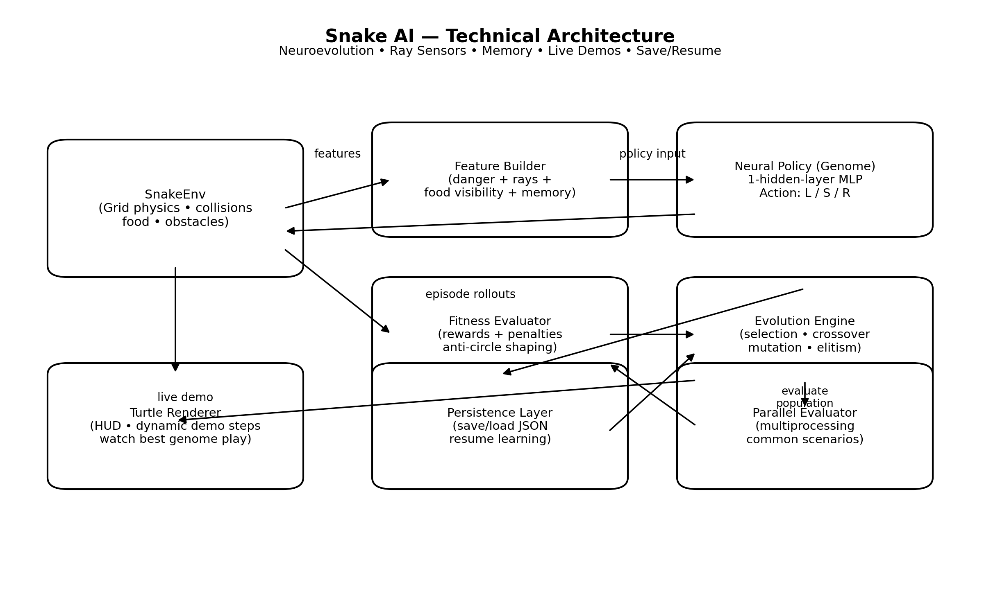

# 🐍 Snake AI by Lance Jepsen (Neuroevolution in Python) 
### Neuroevolutionary Snake Agent in Python


🚀 **Snake AI by Lance Jepsen** is a live-learning Snake game powered by **neuroevolution** — not hard‑coded rules, not pre‑trained models, but an AI that *learns from scratch* by evolving neural networks generation after generation.

This repository contains **two experiences**:
1. 🧠 **An AI that learns to play Snake in real time**
2. 🎮 **A classic Snake game YOU can play yourself**

---

## 🧠 What Makes This Project Special?

Unlike typical Snake AI demos, this project features:

- ✅ Live learning via **neuroevolution**
- ✅ Ray‑based perception (walls, obstacles, tail, food)
- ✅ Short‑term memory to avoid loops
- ✅ Anti‑circle fitness shaping
- ✅ Curriculum learning with moving obstacles
- ✅ Real‑time visualization (Turtle)
- ✅ Save & resume learning anytime

No pretrained weights.  
No shortcuts.  
Just evolution. 🧬

---

## 📂 Repository Structure

```
├── snake_ai.py                  # 🤖 Main Snake AI (neuroevolution + live demo)
├── snake_you_play.py            # 🎮 Classic Snake — YOU play!
├── README.md                    # 📘 You are here
```

---

## 🎮 Play Snake Yourself (No AI)

Run:
```bash
python snake_you_play.py
```

Controls:
- Arrow keys ⬅️⬆️⬇️➡️ to move
- Close the window to quit

Pure arcade Snake fun 🕹️

---

## 🤖 Run the Snake AI (Watch It Learn)

```bash
python live_snake_neuroevo_turtle.py
```

Controls:
- Space → Pause / Resume
- Q → Quit and save progress
- R → Reset learning (delete save file)

Watch the AI:
- Crash
- Adapt
- Learn
- Dominate

---

## 🧬 How the AI Learns

- Each snake is a neural network
- A genetic algorithm selects the best performers
- Networks evolve via mutation and crossover
- Fitness rewards:
  - Eating food 🍎
  - Moving toward food
  - Survival
- Penalties discourage:
  - Circling
  - Oscillation
  - Self‑trapping

---

## 🏗️ Technical Architecture



## Component Breakdown  

## 1) SnakeEnv (Environment / Game Simulation)  
Responsibility: Owns the truth of the world.
- Grid-based movement (arcade style)
- Food spawning with wall margin
- Collision rules (walls, obstacles, tail)
- Optional moving obstacles (curriculum)
- Generates a feature vector for the agent
## Key output: features = env.get_features()
This includes:
- Danger sensors (blocked straight/left/right)
- Distance rays to wall/obstacle
- Tail distance rays (self-body)
- Food-ray visibility (straight/left/right)
- Direction one-hot
- Food relative position
- Short-term memory (recent actions)

## 2) Neural Policy (Genome → Action)  
Responsibility: Convert features into a decision.
- A genome is a flat parameter vector (weights + biases)
- Unpacked into a small MLP:
- Input: features
- Hidden: ReLU
- Output: 3 logits → action {left, straight, right}
## Key output: action = argmax(policy(features))

## 3) Fitness Evaluator (Learning Signal)
Responsibility: Turn an episode into a scalar score for evolution.
Rewards:
- eating food (large)
- moving closer to food (dense shaping)
- survival (tiny)
## Penalties:
- moving away from food
- oscillation (left-right spam)
- revisiting recent cells (anti-circle)
- stagnation (no progress for N steps)
- death
## This is the most important part of neuroevolution:
## the evaluator defines what “good behavior” means.

## 4) Evolution Engine (Genetic Algorithm)  
Responsibility: Improve the population without gradients.
- Selection: tournament selection
- Elitism: keep the best genomes unchanged
- Crossover: combine parent parameters
- Mutation: random perturbations to weights
## This produces the next generation:
## population_next = evolve(population, fitness)

## 5) Renderer (Turtle Live Demo)
Responsibility: Show what the AI is learning without slowing training too much.
- Uses headless training most of the time
- Periodically runs a demo episode with the best genome
Includes:
- Border / grid scale to screen
- HUD for gen, best score, avg score
- dynamic demo steps (better agent → longer demo)

## 6) Persistence Layer (Save/Resume)
Responsibility: Make learning durable.
- Saves the full population and metadata to a JSON file:
- generation
- best-ever
- obstacle layout seed/state
- population genomes
Supports:
- Q to quit + save
- R to reset learning (delete save)

## 7) Parallel Evaluation (Multiprocessing)
Responsibility: Speed.
- Evaluates many genomes simultaneously across CPU cores
## Uses common random scenarios per generation so selection is fair: each genome faces the same set of seeds

## Why this architecture works
- Fast iteration: headless training + selective demos
- Stable selection pressure: common scenarios + elite re-eval
- Better navigation: ray sensors + memory + food visibility rays
- Generalization: curriculum introduces complexity gradually

---
 

## 🔍 Keywords

Snake AI · Neuroevolution · Genetic Algorithm · Python · Game AI · Machine Learning · Artificial Intelligence

---

## 👤 Author

**Lance Jepsen**  
Python · AI · Data Science · Automation

If you enjoy this project, ⭐ the repo and share it, that’s how open source grows.
